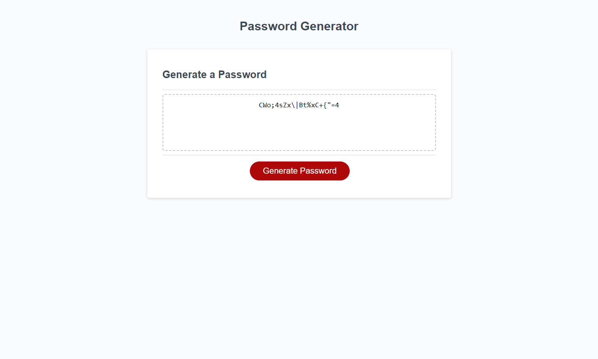

# Password Generator

## Description
Having strong passwords is an important component to our overall cyber security. Therefore, this website was created to make it easy for users to generate passwords of various lengths and character types. A new password can be generated quickly and effectively with minimal effort. With this project, I learned that JavaScript can be used to make utility tools that can save users time.

## Website Screenshot

## Published Website

https://dhoneck.github.io/password-generator/